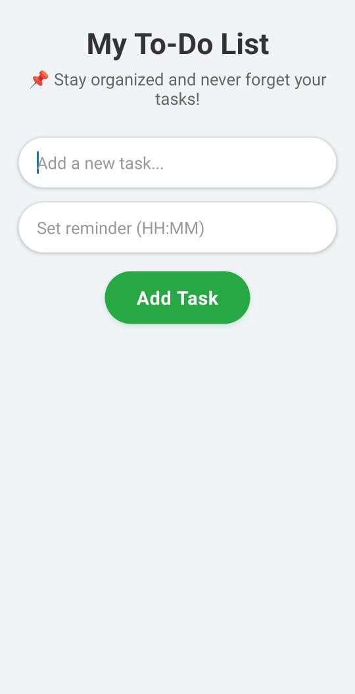
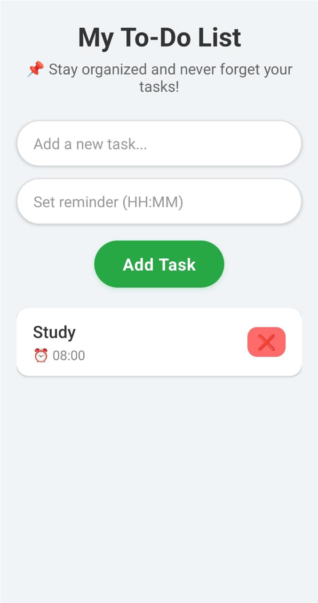

# Welcome to My To-Do List App

A modern and user-friendly To-Do List application built using **React Native** and **Expo**.
This app helps users manage daily tasks efficiently by allowing them to add tasks, set reminders, and organize activities in a clean and interactive interface.

The project follows a frontend-backend architecture using **React Native** for the mobile interface and **Node.js + Express.js** for backend services.

---

# ✨ Features

✅ Add New Tasks

✅ Set Optional Reminders

✅ Delete Tasks Individually

✅ Clean and Modern User Interface

✅ Responsive Layout

✅ Keyboard Friendly Input Handling

✅ Styled Task Cards with Shadows

✅ Frontend & Backend Integration

✅ Mobile App using React Native & Expo

---

# 📱 Screenshots

## 🏠 Task List Screen

<p align="center">
  
</p>

## ✍️ Enter Task Screen

<p align="center">
  
</p>


## ➕ Add Task Screen

<p align="center">
  
</p>


---

# ⚙️ How It Works

The application follows a simple task management workflow.

```txt
User Input
     │
     ▼
┌──────────────────────┐
│ 1. TASK INPUT        │
│ Enter task name      │
│ Add reminder time    │
└──────────┬───────────┘
           │
           ▼
┌──────────────────────┐
│ 2. FRONTEND PROCESS  │
│ React Native UI      │
│ Input validation     │
└──────────┬───────────┘
           │
           ▼
┌──────────────────────┐
│ 3. BACKEND SERVER    │
│ Express.js API       │
│ Task handling        │
└──────────┬───────────┘
           │
           ▼
┌──────────────────────┐
│ 4. TASK DISPLAY      │
│ Show tasks           │
│ Delete tasks         │
└──────────────────────┘
```

---

# 📂 Project Structure

```txt
To_Do_List/
│
├── backend/
│   ├── server.js              # Express.js backend server
│   └── package.json           # Backend dependencies
│
├── frontend/
│   │
│   ├── app/
│   │   └── index.js           # Main frontend screen
│   │
│   ├── App.js                 # Expo entry point
│   ├── app.json               # Expo configuration
│   ├── package.json           # Frontend dependencies
│   ├── tsconfig.json          # TypeScript configuration
│   ├── README.md              # Project documentation
│   │
│   └── screenshots/
│       ├── task-list.png
│       ├── enter-task.png
│       └── add-task.png
```
---

# 🚀 Setup and Installation

## 📌 Prerequisites

Make sure the following are installed:

* Node.js (v16 or higher)
* npm or yarn
* Expo CLI

Install Expo CLI:

```bash
npm install -g expo-cli
```

---

# 🔧 Backend Setup

```bash
cd backend
npm install
node server.js
```

The backend server will run on:

```txt
http://localhost:3000
```

---

# 📱 Frontend Setup

```bash
cd frontend
npm install
npx expo start
```

---

# 🎯 Usage

1️⃣ Open the app using Expo Go or Emulator

2️⃣ Enter a task in the input field

3️⃣ Optionally add reminder time

4️⃣ Press **Add Task** button

5️⃣ Tasks will appear in the task list

6️⃣ Delete tasks using the ❌ button

---

# 🌐 Platform-Specific Backend URL

## Android Emulator

```txt
http://10.0.2.2:3000
```

## iOS Simulator

```txt
http://localhost:3000
```

## Web / Other

```txt
http://localhost:3000
```

> Update backend URL in `app/index.js` if needed.

---

# 🌈 Future Improvements

✅ Task Completion Toggle

✅ Push Notification Reminders

✅ Database Integration (MongoDB / SQLite)

✅ Swipe-to-Delete Feature

✅ Dark Mode Support

✅ User Authentication

✅ Cloud Synchronization

---

# 🛠 Troubleshooting

## Backend Not Connecting

Ensure backend server is running on port 3000.

---

## Port Already in Use

```bash
taskkill /F /IM node.exe
```

---

## Expo Cache Issues

```bash
npx expo start --clear
```

---

# 💻 Development Notes

## Frontend

* Built using React Native
* Expo framework for development
* UI designed using React Native components

## Backend

* Node.js + Express.js server
* Handles task management APIs
* Uses in-memory storage for demo purposes

## Styling

* React Native StyleSheet API
* Responsive mobile design

---

# 🧠 Technologies Used

## Frontend

* React Native
* Expo

## Backend

* Node.js
* Express.js
* CORS

## Development Tools

* Expo CLI
* npm

---

# 🎯 Target Audience

This project is designed for:

* Students
* Daily Task Managers
* Productivity Users
* React Native Beginners
* Mobile App Development Learning

---

# 👥 Team Information

## Mobile Application Development Project

Presented By:

| Name           | Roll Number |
| -------------- | ----------- |
| Zainab Shaheen | 8583        |

---

# 📄 License

This project is developed for **educational purposes**.

---

# ✅ Conclusion

The To-Do List App provides a simple yet effective solution for task management using React Native and Expo.
The project demonstrates frontend-backend integration, mobile UI development, and basic API handling in a clean and user-friendly environment.

---

# 🌟 To-Do List App

### “Stay Organized. Stay Productive.”

Built with ❤️ using React Native & Expo
